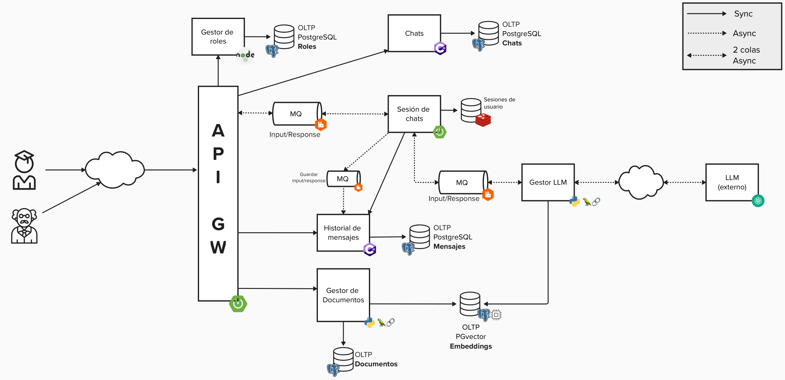
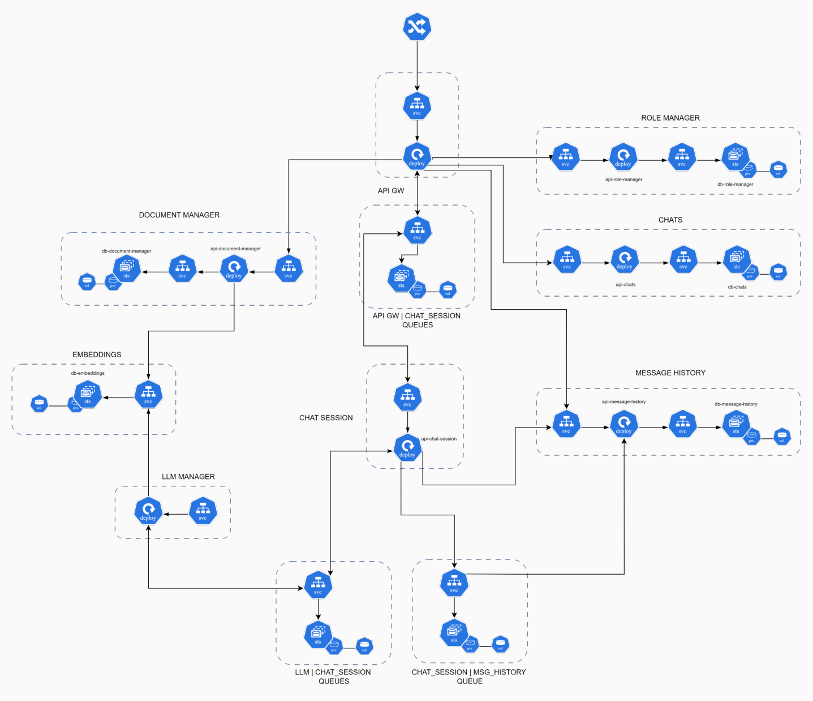

# What is this repo about?

This repository contains the code for a microservices application of a RAG Chatbot.

## Architecture

A logic view of the app's architecture can be seen on the following image.

</img>

A more precise view showing k8s resources can be seen in this image:

</img>

## Project structure

-   `docs/`: Contains guides to deploy a Gitlab runner on a Pod and inside a Docker container.

-   `infra/`: Contains very simple stress tests written using k6.

-   `helm-charts/`: Self-explanatory. Contains the helm charts to deploy the resources shown in the images above.

Every other folder contains the code for a microservice which can be seen in the images above.

## Authors

-   Santino Augusto Ranucci
-   Saul Ariel Castañeda
-   Nicolás Matías Margenat
